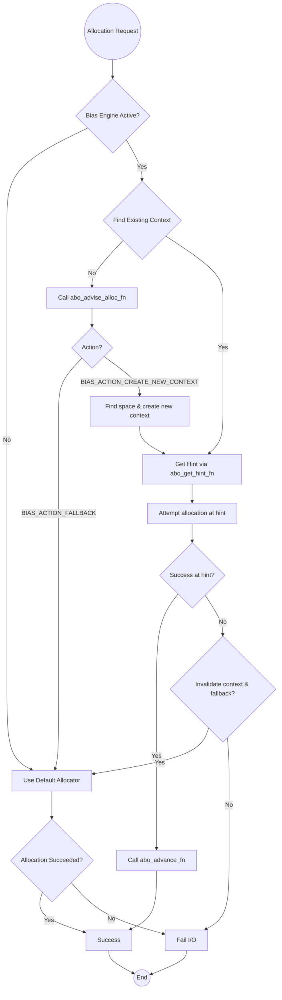
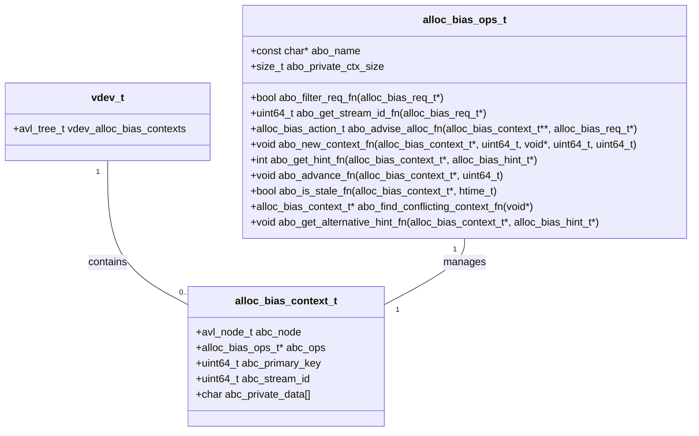

### **Specification: ZFS Allocation Bias Framework (v 1.0)**

#### Preface: Solving the Allocation Performance Gap in ZFS
In many large-scale workloads, ZFS performance on spinning disks is frequently dominated by disk head seeks, not raw bandwidth. The default ZFS allocator strategies, optimized for general-purpose use, can scatter data and metadata blocks across an entire pool. This can reduce spatial locality, leading to performance degradation in I/O patterns sensitive to seek latency.

To address this, the **Allocation Bias Framework** provides a generic, pluggable interface to override the default allocator with specialized, policy-driven engines. This framework is a policy-free layer that enables the development of custom allocators tailored to specific workloads, such as archival, databases, or virtual machine images.

#### 1. Overview & Core Principles
The **Allocation Bias Framework** is a policy-free layer integrated at the `vdev` level. It intercepts allocation requests within `metaslab_alloc()` and dispatches them to a registered, active bias engine. The framework manages stateful contexts for I/O streams in an AVL tree and extends `zio_t` to carry contextual information (e.g., UID, GID, PGID) to the engine.

Engines implementing this framework should be designed with the following principles in mind:
1.  **Volatile, In-Memory State**: Engine contexts should be volatile, providing soft reservations and hints without modifying the on-disk free space map until a block is physically allocated.
2.  **Crash and Leak Proof**: The engine should not persist its own state. State should be rebuilt dynamically from incoming I/O requests, ensuring no leaks or corruption can occur on a system crash.
3.  **Graceful Degradation**: Engines should be designed to fall back gracefully to the default ZFS allocator when they cannot satisfy a request, ensuring system stability.
4.  **Self-Correcting**: The engine's state should be treated as a set of hints. It must be able to detect and recover from conflicts with the authoritative on-disk free space map.

#### 2. Framework API & Data Structures

##### `alloc_bias_ops_t`
A stateless vtable defining the interface for all bias engines. This is the "contract" an engine must fulfill.

```c
typedef struct alloc_bias_ops {
    const char *abo_name; // Engine's unique name
    size_t abo_private_ctx_size; // Size of engine-specific private data

    // Fast filter to determine if the engine should handle this request.
    bool (*abo_filter_req_fn)(const alloc_bias_req_t *req);
    // Classifies a request into an engine-defined stream.
    uint64_t (*abo_get_stream_id_fn)(const alloc_bias_req_t *req);
    // The main decision-making function to advise the allocator.
    alloc_bias_action_t (*abo_advise_alloc_fn)(alloc_bias_context_t **abc_p, const alloc_bias_req_t *req);
    // Initializes a new engine context.
    void (*abo_new_context_fn)(alloc_bias_context_t *abc, uint64_t stream_id, void *abh_region_handle, uint64_t segment_start, uint64_t segment_size);
    // Fills a hint structure from the engine's private context.
    int (*abo_get_hint_fn)(alloc_bias_context_t *abc, alloc_bias_hint_t *hint_out);
    // Updates the engine's context after a successful allocation.
    void (*abo_advance_fn)(alloc_bias_context_t *abc, uint64_t allocated_size);
    // Checks if an engine's context is stale and can be cleaned up.
    bool (*abo_is_stale_fn)(alloc_bias_context_t *abc, htime_t now);
    // Checks if a hint from the default allocator conflicts with a reservation.
    alloc_bias_context_t *(*abo_find_conflicting_context_fn)(const void *hint_handle);
    // Provides an alternative hint to resolve a conflict.
    void (*abo_get_alternative_hint_fn)(alloc_bias_context_t *conflicting_abc, alloc_bias_hint_t *hint_out);
} alloc_bias_ops_t;
```

##### Generic Data Structures

```c

// high resolution time
 typedef uint64_t htime_t; 

// A generic, stateful context for a single biased stream.
typedef struct alloc_bias_context {
    avl_node_t abc_node;
    alloc_bias_ops_t *abc_ops;
    uint64_t abc_primary_key; // Engine-defined key
    uint64_t abc_stream_id;   // Engine-defined stream
    char abc_private_data[];  // Engine-specific state
} alloc_bias_context_t;

// Packages an allocation request for the engine.
typedef struct alloc_bias_req {
    void *abr_io_req;
    uint64_t abr_size;
    alloc_bias_hint_t *abr_backend_hint;
} alloc_bias_req_t;

// The engine’s allocation hint.
typedef struct alloc_bias_hint {
    void *abh_region_handle; // Opaque region (e.g., metaslab_t*)
    uint64_t abh_offset;
} alloc_bias_hint_t;

// Directs the core allocator’s next action.
typedef enum alloc_bias_action {
    BIAS_ACTION_FALLBACK,
    BIAS_ACTION_ALLOC_FROM_HINT,
    BIAS_ACTION_CREATE_NEW_CONTEXT
} alloc_bias_action_t;
```

#### 3. Framework Integration
The framework integrates at the `vdev` level by storing engine contexts in an AVL tree, protected by the `vdev_metaslab_lock`.

```c
// in struct vdev:
avl_tree_t vdev_alloc_bias_contexts; // AVL tree of alloc_bias_context_t
```

The public API for managing engines is as follows:
-   `int ab_register_engine(const char *name, alloc_bias_ops_t *ops)`: Registers a new engine.
-   `void ab_deregister_engine(const char *name)`: Deregisters an engine.
-   `alloc_bias_ops_t *ab_find_engine_by_name(const char *name)`: Finds an engine by its name.

#### 4. Configuration
The framework introduces a single ZFS property to select the active engine.

-   `allocation:strategy = "default" | <engine_name>` (default: `default`): Selects the allocation bias engine for a dataset. Setting it to "default" disables the framework for that dataset.

#### 5. State Management & Cleanup
During `sync()`, the complient implementation scans the `vdev_alloc_bias_contexts`. For each context, it calls the engine's `abo_is_stale_fn` function. If this function returns true, the framework removes the context and frees its associated resources.

#### 6. Future Work
The Allocation Bias Framework is designed for extensibility. Future work involves creating new engines to solve other workload-specific performance challenges, such as:
-   A **locality engine** to intelligently re-locate blocks belonging to the same class of objects.
-   An **ML-driven engine** that uses userspace hooks (e.g., FUSE or `ioctl`) to adapt to dynamically changing I/O patterns.

#### 7. UML Diagrams

##### Framework Allocation Flow


##### Framework Class Diagram

