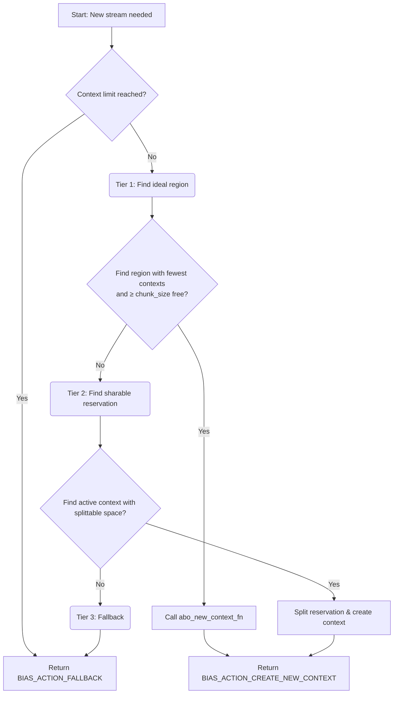
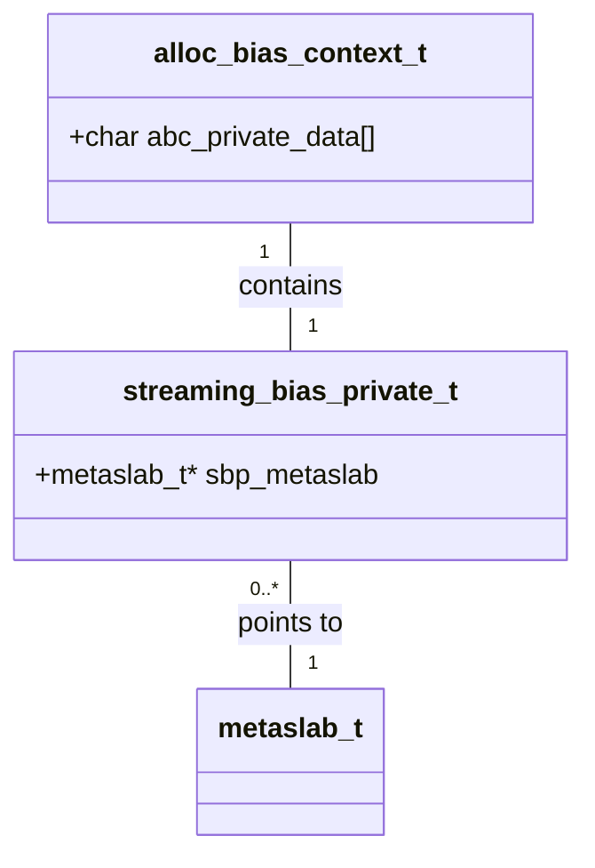

### **Specification: Streaming Bias Engine (v 1.0)**

#### Preface: Solving the Archival Performance Gap
In large-scale archival workloads, such as legal document repositories or backup systems, ZFS performance on spinning disks is often limited by disk head seeks when millions of small files are written concurrently. The **Streaming Bias Engine** is an implementation of the Allocation Bias Framework designed specifically to solve this problem. It is activated by the `allocation:strategy=streaming` dataset property. The engine optimizes write-heavy, concurrent archival workloads by ensuring contiguous on-disk allocation, isolating writers, and separating data and metadata streams.

#### 1. Overview & Core Principles
The Streaming Bias Engine leverages the Allocation Bias Framework to enforce a linear, streaming allocation pattern. Its goals are to:
-   Ensure a contiguous on-disk layout for related writes.
-   Isolate concurrent writers (by PGID, UID, or GID) to prevent their I/O streams from interleaving on disk.
-   Separate data and metadata into distinct, linear streams to optimize access patterns for operations like `find`, `ls -lR`, `zfs send`, and `zpool scrub`.

It operates on the four core principles of the framework:
1.  **In-Memory**: Contexts are volatile and represent soft reservations.
2.  **Crash and Leak Proof**: No persistent state is modified outside of the main ZFS transaction group, ensuring crash safety.
3.  **Tiered Logic with Graceful Degradation**: It first attempts perfect writer isolation, degrades to sharing space if necessary, and finally falls back to the default allocator.
4.  **Self-Correcting**: It treats its reservations as hints and can invalidate its own context if the on-disk reality conflicts with its assumptions.

#### 2. Data Structures

##### `streaming_bias_private_t`
This engine-specific state is stored in the `abc_private_data` field of an `alloc_bias_context_t`.

```c
typedef enum stream_type {
    STREAM_TYPE_DATA,
    STREAM_TYPE_METADATA
} stream_type_t;

typedef struct streaming_bias_private {
    stream_type_t sbp_stream_type; // DATA or METADATA
    metaslab_t *sbp_metaslab;       // The metaslab this context has reserved space in
    uint64_t sbp_segment_start;     // The start of the soft reservation
    uint64_t sbp_segment_end;       // The (mutable) end of the soft reservation
    uint64_t sbp_cursor;            // The current allocation offset within the segment
    uint64_t sbp_chunk_size;        // The ideal size for a contiguous chunk
    uint64_t sbp_last_used;         // Timestamp of the last allocation activity
} streaming_bias_private_t;
```

#### 3. Configuration
The Streaming Bias Engine is controlled by the following ZFS properties:
-   `streaming:bias_key = "pgid" | "uid" | "gid"` (default: `pgid`): The key used to isolate and identify a unique writer stream.
-   `streaming:max_contexts = 64`: The maximum number of concurrent streams (and thus reservations) allowed per vdev.
-   `streaming:timeout_data = 300s`: Inactivity timeout in seconds after which a data stream's context is considered stale.
-   `streaming:timeout_metadata = 600s`: Inactivity timeout for metadata streams.
-   `streaming:max_chunk_size_data = 256M`: The maximum size of a contiguous reservation segment for a data stream.
-   `streaming:max_chunk_size_metadata = 64M`: The maximum size of a reservation for a metadata stream.

#### 4. Core Algorithm I: New Stream Activation
This logic is executed by `abo_advise_alloc_fn` when no context exists for an incoming request's key (PGID/UID/GID).

**Initial Step: Check Context Limit**
1.  If the number of active contexts in `vdev_alloc_bias_contexts` is at or above `streaming:max_contexts`, return `BIAS_ACTION_FALLBACK`.

**Tier 1: Ideal Path (Perfect Isolation)**
1.  Iterate through the vdev’s metaslabs.
2.  Find a metaslab with the fewest active contexts that also has a free segment ≥ the required `max_chunk_size` for the stream type.
3.  If found, return `BIAS_ACTION_CREATE_NEW_CONTEXT`. The `abo_new_context_fn` will then be called to initialize the `streaming_bias_private_t` with this new reservation.

**Tier 2: Pragmatic Path (Fair Reservation Splitting)**
1.  If Tier 1 fails, scan existing contexts.
2.  Find a "donor" context that has enough unallocated space in its reservation to be split. The sharable space must be ≥ `max_chunk_size`.
3.  If found, cap the donor’s `sbp_segment_end` and return `BIAS_ACTION_CREATE_NEW_CONTEXT` to create a new context in the newly freed portion of the reservation.

**Tier 3: Fallback Path**
1.  If Tiers 1 and 2 fail, return `BIAS_ACTION_FALLBACK`.

#### 5. Core Algorithm II: Allocation within an Active Stream
This logic handles allocation for a request that has an existing context.

1.  **Filtering and Classification**:
    -   `abo_filter_req_fn`: Returns true for eligible requests (e.g., user data writes).
    -   `abo_get_stream_id_fn`: Classifies the request into `STREAM_TYPE_DATA` or `STREAM_TYPE_METADATA` based on `ZIO_TYPE_*`.
2.  **Chunk Chaining**:
    -   If the current allocation request would exhaust the reserved chunk (`sbp_cursor` reaches `sbp_segment_end`), the engine attempts to find a new chunk within its larger reservation.
    -   If the entire reservation is exhausted, the context is invalidated, and the allocation process restarts from Algorithm I.
3.  **Skip-and-Continue (Fragmentation Handling)**:
    -   If another allocation (e.g., from the default allocator) has "punctured" the soft reservation, the engine detects this and advances its `sbp_cursor` past the unavailable space.
4.  **Hint Generation and Allocation**:
    -   `abo_get_hint_fn`: Populates the hint with `sbp_metaslab` and an offset of `sbp_cursor`.
    -   The core allocator attempts to allocate at the hint.
    -   If `actual_offset == hinted_offset`, `abo_advance_fn` is called to update `sbp_cursor` and `sbp_last_used`.
    -   If `actual_offset != hinted_offset`, the context is considered invalid and is destroyed. The allocation is kept if it's valid; otherwise, the default allocator retries.

#### 6. State Management
The `abo_is_stale_fn` function implements the timeout logic. It returns `true` if `(current_time - sbp_last_used)` is greater than the configured `streaming:timeout_data` or `streaming:timeout_metadata`, signaling to the framework that this context can be cleaned up.

#### 7. UML Diagrams

##### Algorithm I: New Stream Activation


##### Data Structure Relationships

