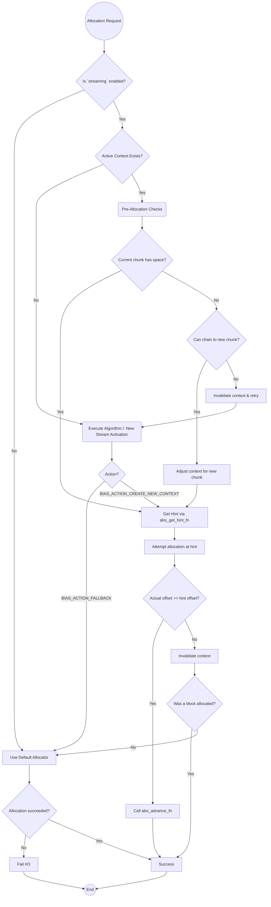
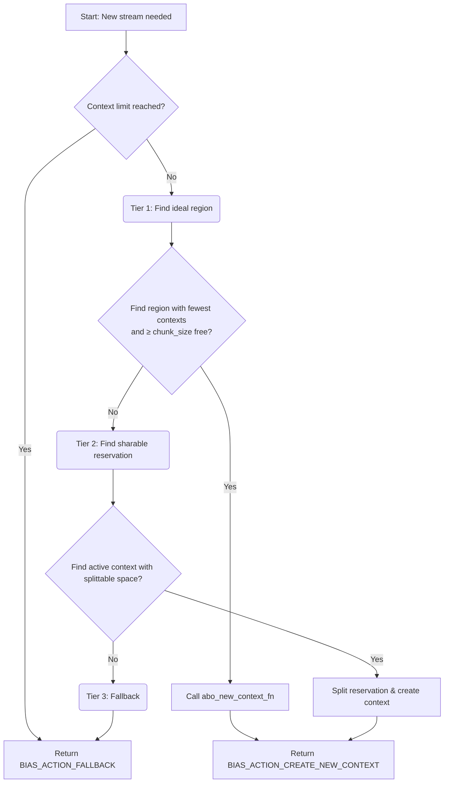
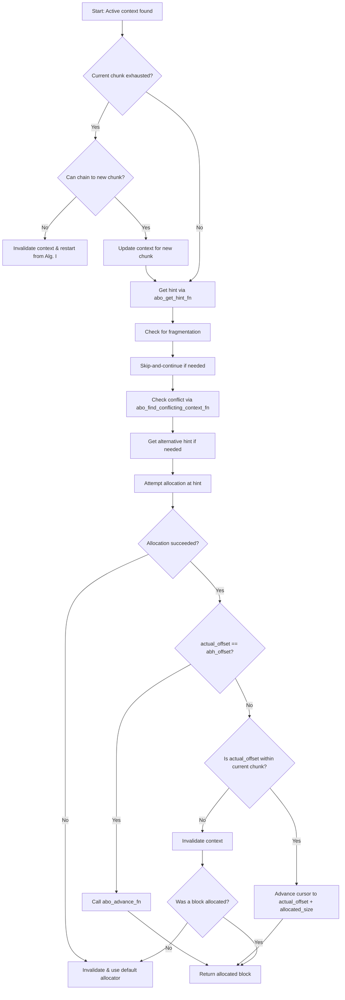
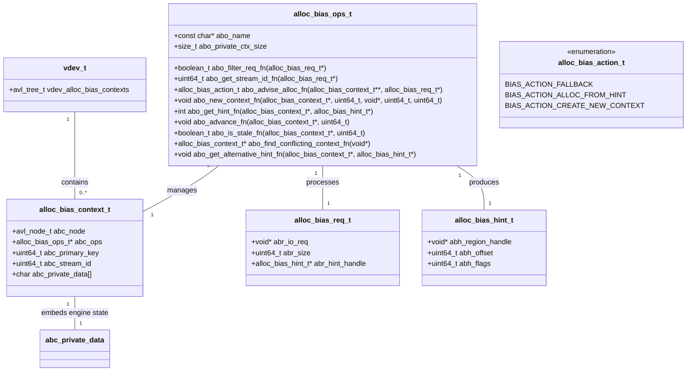
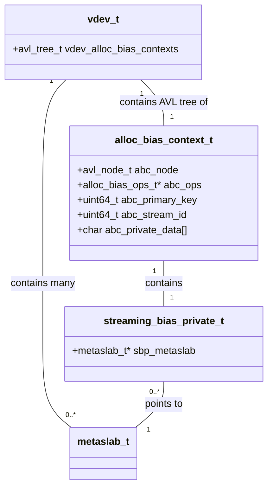

### **Specification: Streaming Allocator for Archival Workloads (v 1.5)**

#### Preface: Solving the Archival Performance Gap in ZFS
In large-scale archival workloads, such as legal document repositories, financial record storage, and backup systems, ZFS performance on spinning disks is frequently dominated by disk head seeks, not raw bandwidth. This issue is most acute when millions of small files are written concurrently. The default ZFS allocator strategies, optimized for general-purpose use, tend to scatter data and metadata blocks across the entire pool. This behavior destroys the spatial locality essential for efficient disk access, resulting in performance degradation—often 10x to 100x slower than theoretically possible—especially for metadata-intensive operations like find, ls -lR, zfs send, and zpool scrub.

To address this, this document specifies the **Streaming Bias Engine**, the first implementation of the **Allocation Bias Framework** (`sys/zfs/alloc_bias.h`), activated by the `allocation:strategy=streaming` dataset property. The engine optimizes write-heavy, concurrent archival workloads by ensuring contiguous allocation, isolating writers (by PGID, UID, or GID), and separating data/metadata streams. The framework provides a generic, pluggable interface for allocation engines, enabling future extensibility.

#### 1. Overview & Core Principles
The **Allocation Bias Framework** is a policy-free layer integrated at the `vdev` level, dispatching allocation requests to pluggable engines via `metaslab_alloc()`. It manages stateful contexts in an AVL tree and extends `zio_t` to carry context (e.g., UID, GID, PGID). The **Streaming Bias Engine** is the first engine, optimizing archival workloads by:
- Ensuring contiguous on-disk layout for related writes.
- Isolating concurrent writers to prevent I/O stream interleaving.
- Separating data and metadata into distinct, linear streams to optimize access patterns and prefetching.

The Streaming Bias Engine follows four principles:
1. **In-Memory**: Contexts are volatile, providing soft reservations and hints without modifying the on-disk free space map until a block is written.
2. **Crash and Leak Proof**: No persistent state ensures crash safety; state is rebuilt on the next write.
3. **Tiered Logic with Graceful Degradation**: Attempts perfect isolation, degrades to sharing, and falls back to the default allocator if needed.
4. **Self-Correcting**: Treats state as hints, invalidating and retrying on conflicts with the block allocator.

#### 2. Data Structures

##### `alloc_bias_ops_t`
A stateless vtable defining the interface for bias engines.

```c
typedef struct alloc_bias_ops {
    const char *abo_name; // Engine name (e.g., "streaming")
    size_t abo_private_ctx_size; // Size of engine-specific private data
    boolean_t (*abo_filter_req_fn)(const alloc_bias_req_t *req);
    uint64_t (*abo_get_stream_id_fn)(const alloc_bias_req_t *req);
    alloc_bias_action_t (*abo_advise_alloc_fn)(alloc_bias_context_t **abc_p, const alloc_bias_req_t *req);
    void (*abo_new_context_fn)(alloc_bias_context_t *abc, uint64_t stream_id, void *abh_region_handle, uint64_t segment_start, uint64_t segment_size);
    int (*abo_get_hint_fn)(alloc_bias_context_t *abc, alloc_bias_hint_t *hint_out);
    void (*abo_advance_fn)(alloc_bias_context_t *abc, uint64_t allocated_size);
    boolean_t (*abo_is_stale_fn)(alloc_bias_context_t *abc, htime_t now);
    alloc_bias_context_t *(*abo_find_conflicting_context_fn)(const void *hint_handle);
    void (*abo_get_alternative_hint_fn)(alloc_bias_context_t *conflicting_abc, alloc_bias_hint_t *hint_out);
} alloc_bias_ops_t;
```

##### `alloc_bias_context_t`
A generic, stateful context for a single biased stream, stored in an AVL tree.

```c
typedef struct alloc_bias_context {
    avl_node_t abc_node; // AVL tree node
    alloc_bias_ops_t *abc_ops; // Engine operations
    uint64_t abc_primary_key; // Engine-defined key (e.g., PGID, UID, GID)
    uint64_t abc_stream_id; // Engine-defined stream (e.g., DATA, METADATA)
    char abc_private_data[]; // Engine-specific state
} alloc_bias_context_t;
```

##### `alloc_bias_req_t`
Packages an allocation request for the engine.

```c
typedef struct alloc_bias_req {
    void *abr_io_req; // IO request details
    uint64_t abr_size; // Requested size
    alloc_bias_hint_t *abr_hint_handle; // Incoming hint from backend
```

##### `alloc_bias_hint_t`
The engine’s allocation hint.

```c
typedef struct alloc_bias_hint {
    void *abh_region_handle; // Opaque region (e.g., metaslab_t*)
    uint64_t abh_offset; // Suggested offset
    uint64_t abh_flags; // Hint flags
} alloc_bias_hint_t;
```

##### `alloc_bias_action_t`
Directs the allocator’s action.

```c
typedef enum alloc_bias_action {
    BIAS_ACTION_FALLBACK, // Use default allocator
    BIAS_ACTION_ALLOC_FROM_HINT, // Allocate from hint
    BIAS_ACTION_CREATE_NEW_CONTEXT // Create new context
} alloc_bias_action_t;
```

##### `streaming_bias_private_t`
Streaming Bias Engine-specific state, stored in `abc_private_data`.

```c
typedef struct streaming_bias_private {
    stream_type_t sbp_stream_type; // DATA or METADATA
    metaslab_t *sbp_metaslab; // Reserved metaslab
    uint64_t sbp_segment_start; // Soft reservation start
    uint64_t sbp_segment_end; // Soft reservation end (mutable)
    uint64_t sbp_cursor; // Current allocation offset
    uint64_t sbp_chunk_size; // Chunk size
    uint64_t sbp_last_used; // Last activity timestamp
} streaming_bias_private_t;
```

##### `vdev_t` Additions
Stores contexts in an AVL tree, protected by `vdev_metaslab_lock`.

```c
// in struct vdev:
// ... existing fields ...
avl_tree_t vdev_alloc_bias_contexts; // AVL tree of contexts
// ... existing fields ...
```

#### 3. Framework Integration
The Allocation Bias Framework integrates at the `vdev` level, hooking into `metaslab_alloc()` to dispatch requests to the active engine (selected via `allocation:strategy`). The public API includes:
- `ab_register_engine(alloc_bias_ops_t *ops)`: Registers a new engine.
- `ab_deregister_engine(alloc_bias_ops_t *ops)`: Deregisters an engine.
- `ab_find_engine_by_name(const char *name)`: Finds an engine by name (e.g., “streaming”).

#### 4. Configuration
- **Framework Property**:
  - `allocation:strategy = "default" | "streaming"` (default: `default`): Selects the engine via `ab_find_engine_by_name`.
- **Streaming Bias Engine Properties**:
  - `streaming:bias_key = "pgid" | "uid" | "gid"` (default: `pgid`): Key for stream isolation.
  - `streaming:max_contexts = 64`: Maximum concurrent streams per vdev.
  - `streaming:timeout_data = 300s`: Inactivity timeout for data streams.
  - `streaming:timeout_metadata = 600s`: Inactivity timeout for metadata streams.
  - `streaming:max_chunk_size_data = 256M`: Maximum data stream consumption.
  - `streaming:max_chunk_size_metadata = 64M`: Maximum metadata stream consumption.

#### 5. Core Algorithm I: New Stream Activation
Executed by `abo_advise_alloc_fn` when no context exists for the key (PGID/UID/GID). Returns an `alloc_bias_action_t`.

**Initial Step: Check Context Limit**
1. Check if `vdev_alloc_bias_contexts` AVL tree size is below `streaming:max_contexts`.
2. If at limit, return `BIAS_ACTION_FALLBACK` (use `metaslab_df_alloc`).

**Tier 1: Ideal Path (Perfect Isolation)**
1. Iterate vdev’s metaslabs.
2. Analyze `vdev_alloc_bias_contexts` AVL tree to find the metaslab with the fewest active contexts and a free segment ≥ `max_chunk_size` (based on `sbp_stream_type`).
3. **On Success**:
   - Create a new context via `abo_new_context_fn`, reserving the segment.
   - Return `BIAS_ACTION_CREATE_NEW_CONTEXT`.

**Tier 2: Pragmatic Path (Fair Reservation Splitting)**
1. **Condition**: Tier 1 fails.
2. Scan in-use contexts in `vdev_alloc_bias_contexts`.
3. Find a donor context where sharable space (`sbp_segment_end - (sbp_segment_start + sbp_chunk_size)`) is ≥ `max_chunk_size`.
4. **On Success**:
   - Cap donor’s `sbp_segment_end`.
   - Create a new context via `abo_new_context_fn`.
   - Return `BIAS_ACTION_CREATE_NEW_CONTEXT`.

**Tier 3: Fallback Path**
1. **Condition**: Tiers 1 and 2 fail.
2. Return `BIAS_ACTION_FALLBACK`.

#### 6. Core Algorithm II: Allocation within an Active Stream
Handles allocation for an existing context, using `abo_get_hint_fn`, `abo_advance_fn`, `abo_find_conflicting_context_fn`, and `abo_get_alternative_hint_fn`.

1. **Filtering and Classification**:
   - `abo_filter_req_fn`: Filters requests (e.g., user data writes).
   - `abo_get_stream_id_fn`: Classifies into streams (`ZIO_TYPE_DATA` for data, `ZIO_TYPE_DNODE`, etc., for metadata).
2. **Chunk Chaining**:
   - If `sbp_cursor` depletes the chunk, chain to a new chunk in the reservation.
   - If reservation is exhausted, invalidate context and restart via Algorithm I.
3. **Skip-and-Continue (Fragmentation)**:
   - If a rogue allocation punctures the segment, advance `sbp_cursor` past it.
4. **Hint Manipulation (Conflict Avoidance)**:
   - `abo_find_conflicting_context_fn`: Checks if default allocator’s `hint_handle` conflicts with the context.
   - `abo_get_alternative_hint_fn`: Provides an alternative hint if needed.
5. **Get Hint**:
   - `abo_get_hint_fn`: Sets `hint_out->abh_offset = sbp_cursor`.
6. **Attempt Allocation**:
   - Allocate using the hint.
   - If `actual_offset == abh_offset`: Call `abo_advance_fn` to update `sbp_cursor` and `sbp_last_used`.
   - If `actual_offset != abh_offset`: Invalidate context. Keep allocated block if valid; otherwise, fall back to `metaslab_df_alloc`.

#### 7. State Management & Cleanup
During `spa_sync()`, scan `vdev_alloc_bias_contexts`. For each context:
- If `(current_time - sbp_last_used) > streaming:timeout_data` (data) or `streaming:timeout_metadata` (metadata), call `abo_is_stale_fn` to confirm staleness and remove the context from the AVL tree.

#### 8. Future Work
The Allocation Bias Framework supports new engines, such as:
- A locality engine for contiguous file allocation.
- An ML-driven engine using userspace hooks (FUSE or `ioctl`).

#### 9. UML Diagrams

##### Allocation Flow
Decision tree for allocation requests.



##### Algorithm I: New Stream Activation
Three-tiered logic for creating a new stream.



##### Algorithm II: Allocation within an Active Stream
Hot path for active streams.



##### Framework Class Diagram
Shows the Allocation Bias Framework’s components.



##### Data Structure Relationships
Shows Streaming Bias Engine relationships.

