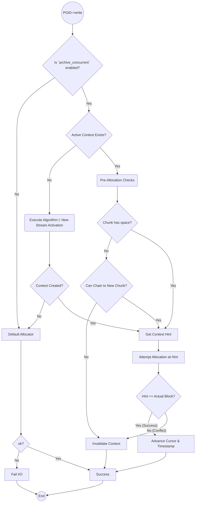

## UML diagrams

```mermaid
graph TD
    A((PGID->write)) --> B{Is `archive_concurrent` enabled?};
    B -- No --> C[Default Allocator];
    B -- Yes --> D{Active Context Exists?};
    
    D -- No --> ALG1(Execute Algorithm I: New Stream Activation);
    ALG1 --> H{Context Created?};
    H -- No --> C;
    H -- Yes --> F[Get Context Hint];
    
    D -- Yes --> ALG2_PRE(Pre-Allocation Checks);
    ALG2_PRE --> K{Chunk has space?};
    K -- No --> L{Can Chain to New Chunk?};
    L -- No --> S[Invalidate Context];
    K -- Yes --> F;
    L -- Yes --> F;

    F --> M[Attempt Allocation at Hint];
    M --> N{Hint == Actual Block?};
    
    N -- Yes (Success) --> T[Advance Cursor & Timestamp];
    T --> SUCCESS[Success];
    
    N -- No (Conflict) --> S;
    S --> SUCCESS;

    C --> R{ok?};
    R -- No --> FAIL[Fail I/O];
    R -- Yes --> SUCCESS;

    FAIL --> X((End));
    SUCCESS --> X((End));

```
