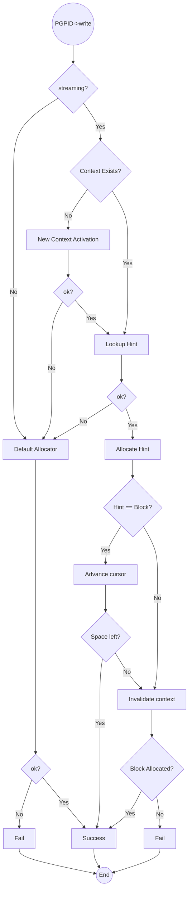

## UML diagrams

```mermaid
graph TD

A((PGPID->write)) --> B{streaming?};
B -- No --> C[Default Allocator];
B -- Yes --> D{Context Exists?};
D -- No --> E[New Context Activation];
D -- Yes --> F[Lookup Hint];
E --> H{ok?};
H -- No --> C;
H -- Yes --> F;
F --> J{ok?};
J -- No --> C;
J -- Yes --> M[Allocate Hint];
C --> K{ok?};
K -- No --> R[Fail];
K -- Yes --> G[Success];
M --> N{Hint == Block?}
N -- Yes --> T[Advance cursor]
N -- No --> S[Invalidate context]
S --> O{Block Allocated?}
O -- Yes --> G
T --> L{Space left?}
O -- No --> Z[Fail]
Z --> X((End))
R --> X
G --> X
L -- Yes --> G
L -- No --> S
```
