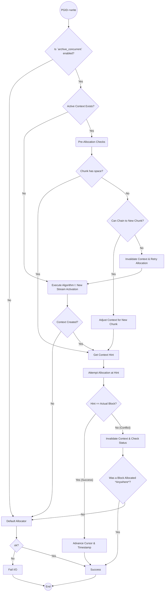
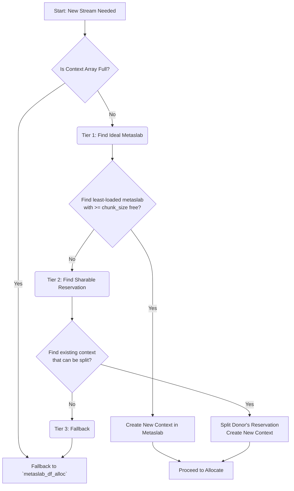
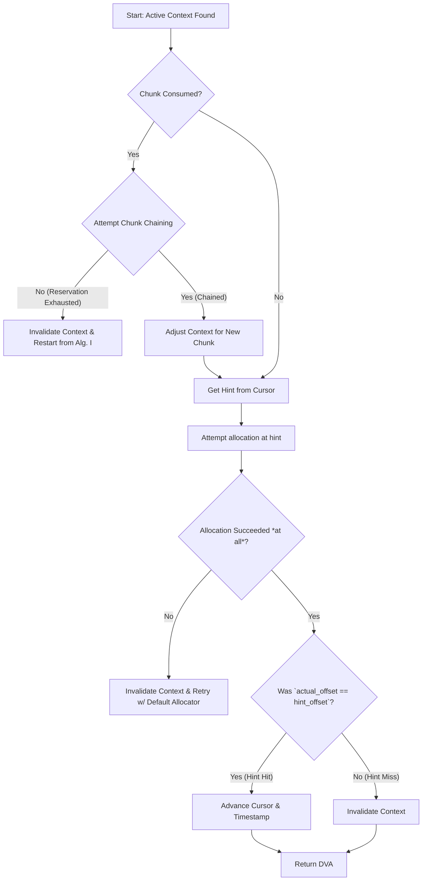
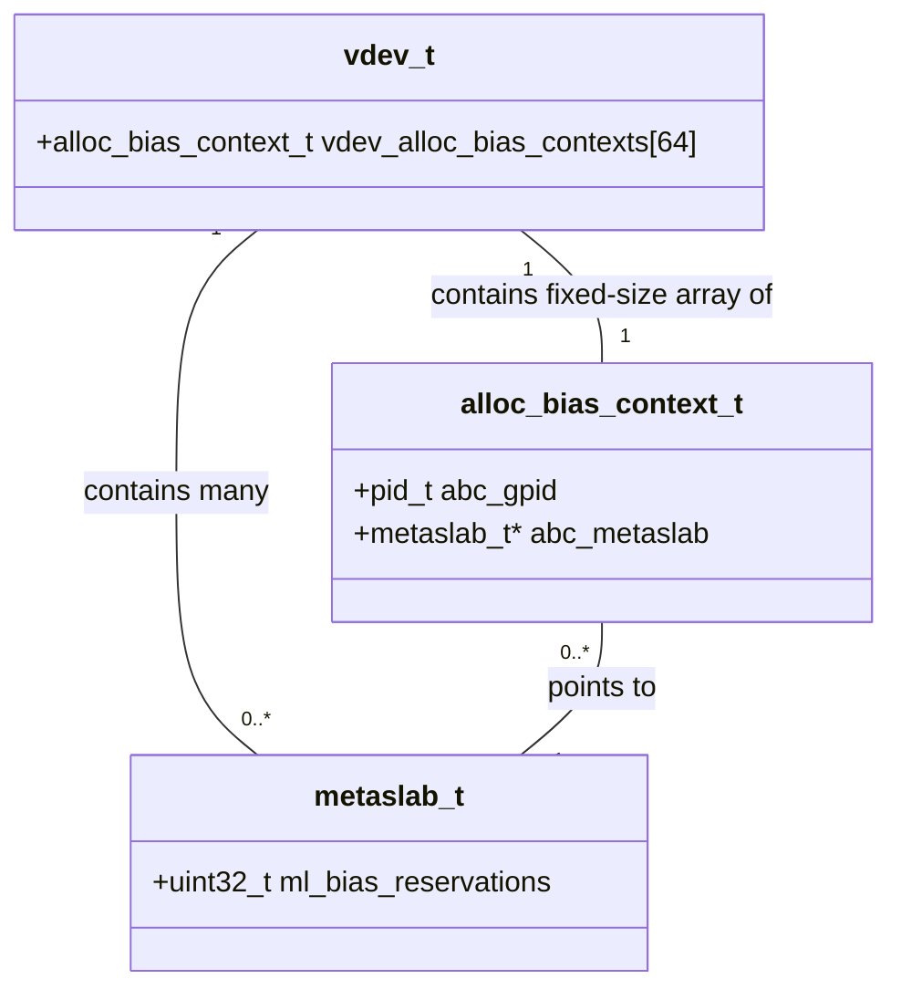

  

### **Specification: Streaming Allocator for Archival Workloads (v 1.3)**

#### 1. Overview & Core Principles

This document specifies the design of a specialized ZFS allocator, activated by the dataset property `allocation=streaming`. Its primary goal is to optimize performance for write-heavy, concurrent archival workloads by ensuring spatial locality for both data and metadata streams.

The allocator is governed by four core principles:

1.  **In-Memory:** The entire system of streaming contexts is a volatile, in-memory overlay. It provides "soft reservations" and allocation hints but **never** modifies the persistent on-disk free space map (AVL trees) until a block is truly being written as part of a transaction.

2.  **Crash and Leak Proof:** Because no persistent state is created for reservations, the system is inherently safe. A crash or unexpected process exit cannot leak space. All state is rebuilt on the next write.

3.  **Tiered Logic with Graceful Degradation:** The allocator uses a tiered funnel to find the best possible allocation. It always attempts to achieve perfect isolation first, then gracefully degrades to sharing, and only falls back to the default allocator as a last resort or if its internal resource limits are met.

4.  **Self-Correcting:** The allocator treats its own state as a hint, not a guarantee. It constantly verifies its predictions against the ground truth of the block allocator and is designed to invalidate its own state and retry if a conflict occurs.


#### 2. Data Structures

  

##### `alloc_bias_context_t`

The core state for an active stream is held in this structure. An entry is considered "in-use" if `abc_gpid != 0`.

```c

typedef  struct alloc_bias_context {

// The Process Group ID this context belongs to. Key for lookups.
// If 0, this entry in the array is considered free.

pid_t abc_gpid;

// The stream type this context serves (e.g., DATA or METADATA).

stream_type_t abc_stream_type;

// Pointer to the metaslab this context has a soft reservation on.

metaslab_t* abc_metaslab;

// ---- The Soft Reservation ----

uint64_t abc_segment_start;

// This value is mutable for the Fair Sharing mechanism.
uint64_t abc_segment_end;

// ---- The Consumption State ----
uint64_t abc_cursor;

uint64_t abc_chunk_size;

// ---- Lifecycle Management ----
uint64_t abc_last_used;

} alloc_bias_context_t;

```
##### `vdev_t` additions

The `vdev_t` struct will hold the pre-allocated array of contexts.

```c

// in struct vdev:

// ... existing fields ...

/*
* A fixed-size array of contexts for the streaming allocator.
* Protected by the vdev_metaslab_lock.
*/

alloc_bias_context_t  vdev_alloc_bias_contexts[archive_max_contexts];

// ... existing fields ...

```

  

##### `metaslab_t` addition

A volatile counter is added to the `metaslab_t` struct for load balancing.

```c

// in struct metaslab:
// ... existing fields ...

uint32_t ml_bias_reservations;

```

#### 3. Configuration

The allocator is controlled by a dataset property and several module parameters or tunables.

*  **Dataset Property:**  `allocation=streaming` (enables the feature).

*  **Module Parameter / Tunable:**

*  `streaming:max_contexts`: Default 64. The maximum number of concurrent streams per vdev. This defines the size of the pre-allocated context array.

*  **Dataset-Scoped Tunables:**

*  `streaming:max_chunk_size_data`: Default 256M. Max consumption per stream for data.

*  `streaming:max_chunk_size_metadata`: Default 64M. Max consumption per stream for metadata.

*  `streaming:context_timeout`: Default 60s. Inactivity timeout for streaming contexts.

  
#### 4. Core Algorithm I: New Stream Activation

This logic is executed when a write occurs for a PGID+StreamType that does not have an existing active context.

**Initial Step: Check for Free Context Slot**

1. Scan the `vdev_alloc_bias_contexts` array.

2. If no entry has `abc_gpid == 0`, the context array is full. The allocator **immediately falls back to `metaslab_df_alloc`** for this transaction and the algorithm terminates here.

##### Tier 1: The Ideal Path (Perfect Isolation & Load Balancing)

1. Iterate through the vdev's metaslabs.

2. Find the metaslab with the **lowest `ml_bias_reservations` count** that also contains a free segment ≥ `max_chunk_size`.

3.  **On Success:**

* Increment the chosen metaslab's `ml_bias_reservations` counter.

* Find a free slot in the context array and populate it.

* The context is configured with a soft reservation over the entire found free segment.

* Proceed to allocate the block (Algorithm II).


##### Tier 2: The Pragmatic Path (Fair Reservation Splitting)

1.  **Condition:** Tier 1 fails to find a suitable metaslab.

2. The allocator now scans the *in-use* entries in the `vdev_alloc_bias_contexts` array.

3. It searches for a "donor" context where the sharable space (`abc_segment_end - (abc_segment_start + abc_chunk_size)`) is ≥ `max_chunk_size`.

4.  **On Success:**

* The donor context's `abc_segment_end` is capped to its fair share.

* A new context for the current PGID is created in a free array slot, reserving the remainder.

* Proceed to allocate the block (Algorithm II).


##### Tier 3: The Fallback Path

  

1.  **Condition:** Tiers 1 and 2 both fail.

2. It **forwards the allocation request to `metaslab_df_alloc`**. No streaming context is created.


#### 5. Core Algorithm II: Allocation within an Active Stream

This logic is executed when an active context for the PGID+StreamType already exists.

1.  **Chunk Chaining Logic:** If the current chunk is depleted, attempt to chain to a new one within the same reservation. If the reservation is exhausted, clear the context (`abc_gpid = 0`), decrement the metaslab's reservation counter, and restart the allocation process from Algorithm I to find a new home for the stream.

2.  **Get Hint:** The allocation hint is `hint_offset = context->abc_cursor`.

3.  **Attempt Allocation & Verify Result:**

* Call the low-level block allocator with the hint.

*  **If `actual_offset == hint_offset` (Success):** Advance the cursor and update the timestamp.

*  **If `actual_offset != hint_offset` (Conflict):** The context is invalid. Clear the context slot (`abc_gpid = 0`), decrement the metaslab's reservation counter, and restart the allocation process from Algorithm I.

#### 6. State Management & Cleanup

Cleanup is performed lazily during `spa_sync()`. A `spa_sync()` thread will scan the `vdev_alloc_bias_contexts` array. For each in-use entry, it checks for timeout:

* If `(current_time - context->abc_last_used) > pid_timeout`, the context is considered stale.

* The entry is cleared by setting `context->abc_gpid = 0`.

* The corresponding metaslab's `ml_bias_reservations` counter is decremented.


## UML diagrams




#### 2. Algorithm I: New Stream Activation

This diagram details the three-tiered funnel logic for creating a new stream. It shows how the allocator tries for the ideal outcome first before gracefully degrading.



**Explanation:** The process begins by checking if a slot is available in the fixed-size context array. If not, it immediately falls back. Otherwise, it attempts the three tiers in order:
1.  **Tier 1:** Tries to find a lightly-used metaslab to ensure physical isolation.
2.  **Tier 2:** If isolation isn't possible, it tries to enable concurrency by splitting an existing large reservation.
3.  **Tier 3:** If neither of the optimized paths is available, it gives up on streaming for this transaction and uses the default allocator.

---

#### 3. Algorithm II: Allocation within an Active Stream

This diagram shows the "hot path" for a stream that is already active. It includes the chunk-chaining logic and the critical self-correction mechanism.



**Explanation:** This is the most common path. The allocator first checks if it needs to advance to a new chunk within its reservation. It then gets its hint (the cursor) and attempts the allocation. The most important step is the verification: if the allocation didn't happen exactly where predicted, the context is considered corrupt and is invalidated, forcing the system to find a new, valid reservation for the stream.

---

#### 4. Data Structure Relationships

This class diagram shows how the core data structures relate to each other.



**Explanation:**
*   A `vdev_t` (vdev) contains the single, fixed-size array of `alloc_bias_context_t`s.
*   A `vdev_t` also contains many `metaslab_t`s.
*   An `alloc_bias_context_t` (a stream context) holds a pointer to exactly **one** `metaslab_t` where its reservation lives.
*   The `ml_bias_reservations` counter on a `metaslab_t` implicitly tracks how many contexts are currently pointing to it, serving as a hint for load balancing. for load balancing.
