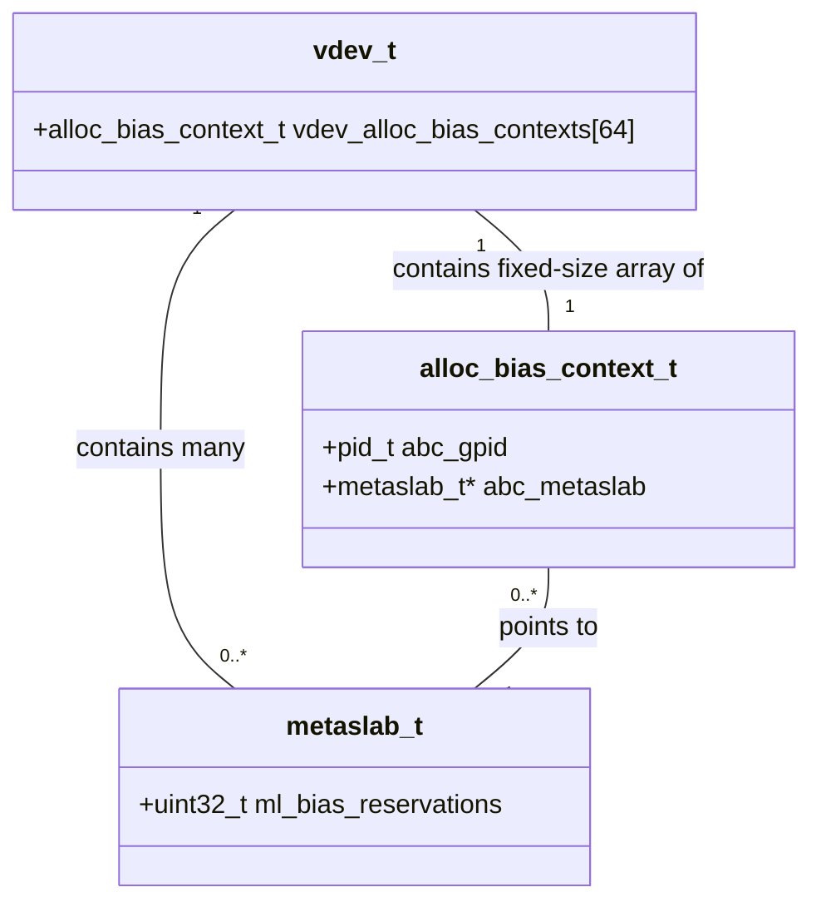

## UML diagrams

```mermaid
classDiagram
    class vdev_t {
        +alloc_bias_context_t vdev_alloc_bias_contexts[64]
    }
    class metaslab_t {
        +uint32_t ml_bias_reservations
    }
    class alloc_bias_context_t {
        +pid_t abc_gpid
        +metaslab_t* abc_metaslab
    }

    vdev_t "1" -- "1" alloc_bias_context_t : contains fixed-size array of
    vdev_t "1" -- "0..*" metaslab_t : contains many
    alloc_bias_context_t "0..*" -- "1" metaslab_t : points to
```
